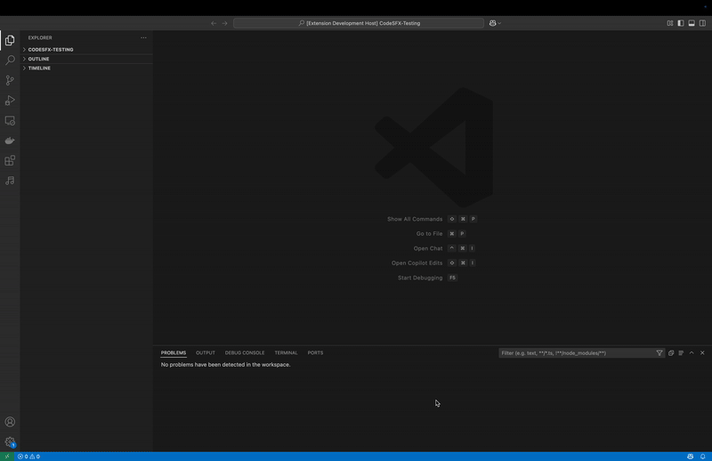

# CodeSFX README

CodeSFX is a Visual Studio Code extension for added accessibility; CodeSFX plays sound effects based on warnings and errors in your code both while writing it, and after running it.

## Features

There are two main features of CodeSFX:

1. While Coding SFX: Plays sounds for both errors and warnings while coding; sounds are triggered by line change. This feature is language agnostic, given you have the proper extensions installed on VS Code for that language.
2. Run with CodeSFX: Runs your program and plays sounds specific to the errors your code encounters. There are currently ten specific errors recognized by CodeSFX - divide by zero error, index out of bounds error, type error / cast exception, stack overflow, key error / null pointer exception, value error / number format exception, iteration and modification error, I/O error, invalid import error, and memory error. This feature is currently compatible with two languages - Python and Java.

## Known Issues

Coming soon!

## Release Notes

### 1.0.0

Initial release of CodeSFX.

## Acknowledgements

Sound files - Jonathan Snead  
CodeSFX logo - Sheldon Marshall
